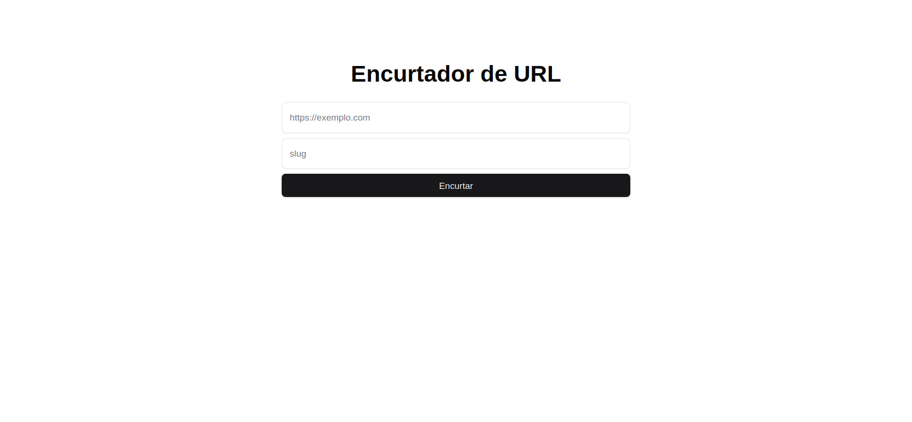

<h1 align="center">
  next-shortener-url
</h1>

<p align="center">
  <a href="#technologies">Technologies</a>&nbsp;&nbsp;&nbsp;|&nbsp;&nbsp;&nbsp;
  <a href="#how-to-use">How To Use</a>
</p>



## Technologies

This project was developed with the following technologies:

- [TypeScript](https://www.typescriptlang.org/)
- [React](https://reactjs.org/)
- [Next.js](https://nextjs.org/)
- [MongoDB](https://www.mongodb.com/products/platform/atlas-database)
- [Prisma ORM](https://www.prisma.io/)
- [Zod](https://zod.dev/)
- [Tailwind CSS](https://tailwindcss.com/)
- [Lucide Icons](https://lucide.dev/)

## How to use

To clone and run this application, you'll need [Git](https://git-scm.com), [Node.js v22.11.0](https://nodejs.org/en/) or higher + [pnpm v9.15.0](https://pnpm.io/) or higher installed on your computer. From your command line:

```bash
# Clone this repository
$ git clone https://github.com/vitoroberto/next-shortener-url.git
# Go into the repository
$ cd next-shortener-url
# Install dependencies
$ pnpm install
# Run the app
$ pnpm run dev
```
